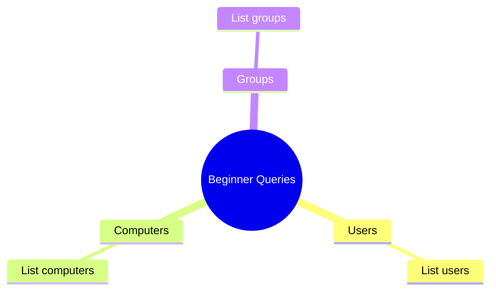
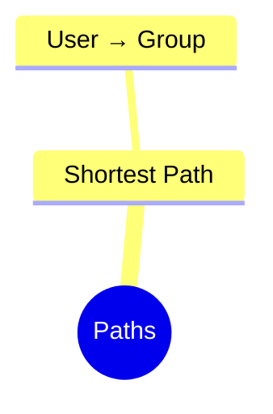

# BloodHound Queries – Beginner Level

## 🔰 Overview

This file contains entry‑level BloodHound queries with simple explanations. Each major section includes a **Mermaid mindmap** for quick visual reference.

---

## 🌐 Basic Discovery Queries

```
MATCH (u:User) RETURN u.name LIMIT 50
```

```
MATCH (c:Computer) RETURN c.name LIMIT 50
```

```
MATCH (g:Group) RETURN g.name LIMIT 50
```

### 🧠 Mindmap



---

## 🧩 Simple Path Queries

```
MATCH p=shortestPath((u:User)-[*1..]->(g:Group))
RETURN p LIMIT 5
```



---

## 🏷️ Color‑Coded Categories

* **Users** → `🟦 Blue`
* **Groups** → `🟩 Green`
* **Computers** → `🟨 Yellow`
